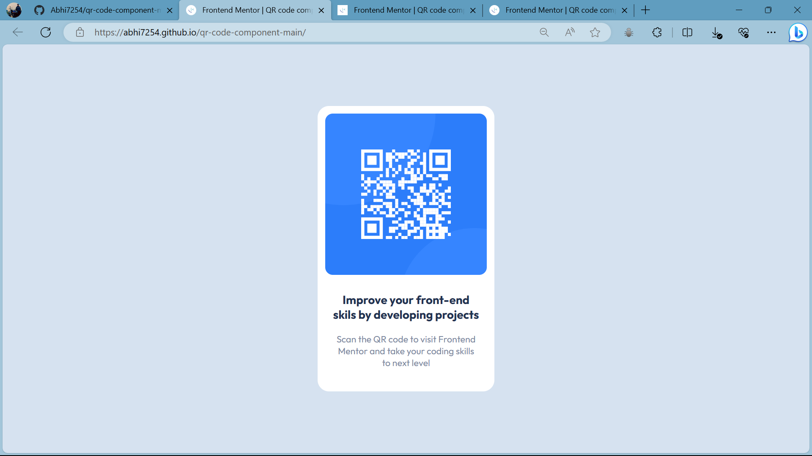

# Frontend Mentor - QR code component solution

This is a solution to the [QR code component challenge on Frontend Mentor](https://www.frontendmentor.io/challenges/qr-code-component-iux_sIO_H). Frontend Mentor challenges help you improve your coding skills by building realistic projects. 

## Table of contents

- [Overview](#overview)
  - [Screenshot](#screenshot)
  - [Links](#links)
- [My process](#my-process)
  - [Built with](#built-with)
  - [What I learned](#what-i-learned)
  - [Continued development](#continued-development)
  - [Useful resources](#useful-resources)
- [Author](#author)

## Overview

### Screenshot

### Links

- Solution URL: 
- Live Site URL: 

## My process

### Built with

- Semantic HTML5 markup
- CSS custom properties
- Flexbox
- Mobile-first workflow

### What I learned

In this project I learned how to center a div and was also able to explore the flexbox feature. Also I learned how to center items inside a div.

### Continued development

I will continue to learn the flexbox properties and how it helps to make the website more responsive.

### Useful resources

- [Resource 1](https://fonts.google.com/) - This helped me in designing the font style of my webpage. The best thing about this site is that, it has lots of verity of font styles with diffrent diffrent font weights.

## Author

- Frontend Mentor - [@yourusername](https://www.frontendmentor.io/profile/Abhi7254)